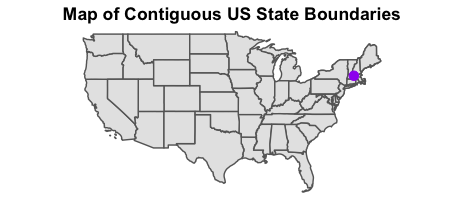
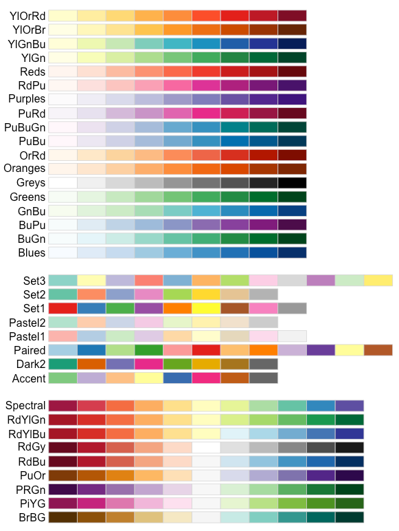
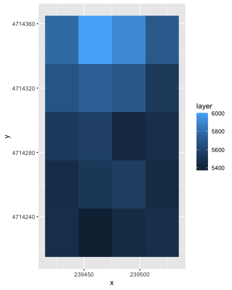
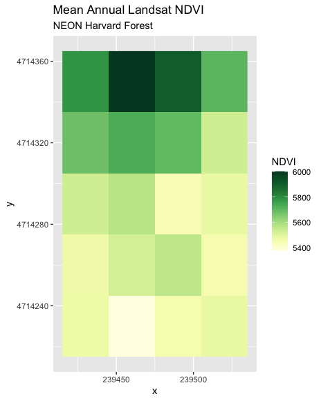
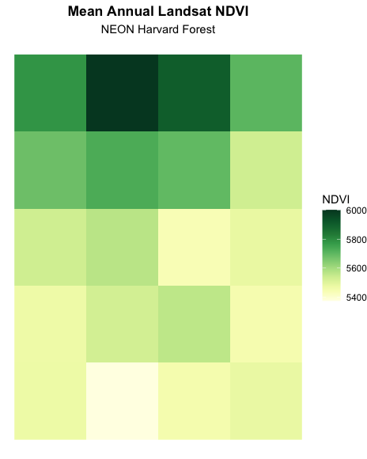
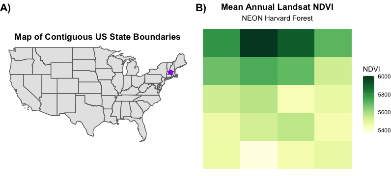

---
# Please do not edit this file directly; it is auto generated.
# Instead, please edit 13-plot-time-series-rasters-in-r.md in _episodes_rmd/
title: "Create Publication-quality Graphics"
teaching: 15
exercises: 15
questions:
- "How can I create a publication-quality graphic and customize plot parameters?"
objectives:
- "Customize raster plots using the `ggplot2` package."
keypoints:
- "Use the `theme_void()` function for a clean background to your plot."
- "Use the `element_text()` function to adjust text size, font, and position."
- "Use the `brewer.pal()` function to create a custom color palette."
- "Use `cowplot` to create paneled figures."
- "Use the `ggsave()` function to save our masterpiece."
source: Rmd
---

> ## Things You’ll Need To Complete This Episode
> See the [lesson homepage]({{ site.baseurl }}) for detailed information about the software,
> data, and other prerequisites you will need to work through the examples in this episode.
{: .prereq}

This episode covers how to customize your raster plots using the `ggplot2` package
in R to create publication-quality plots. 

## The Importance of Publication-Quality Plots

Not only are publication-quality plots pleasing to look at, but they are also valuable tools that can help highlight the most important part of your research: your results! The process from data cleaning to a final publication is often long and requires several rounds of review and revisions and making plots by hand can be time consuming and leave room for human error. Learning to make publication-quality plots using R can help to streamline this process and make figure revisions a breeze! 

[Timo Grossenbacher](https://timogrossenbacher.ch/2016/12/beautiful-thematic-maps-with-ggplot2-only/) has a great tutorial that uses `ggplot2` to make some incredible maps. Consider looking over these materials on your own after this workshop.

## The Flexibility of `ggplot2`

### Setting a Theme

There is an incredible amount of flexibility in the `ggplot2` package that can be applied to maps and general plots. We can play with different visual options using different [pre-set themes](https://ggplot2.tidyverse.org/reference/ggtheme.html) that have already developed for `ggplot2`, or we can create our own by passing arguments to `theme()` at the end of our plot. 

For example, let's re-create the plot we made in a previous episode, but add a theme to the `ggplot` object to make it a little cleaner. 

~~~
ggplot() + 
  geom_sf(data = state_boundary_US, color = "gray40") + 
  geom_sf(data = point_HARV, shape = 19, color = "purple", size = 3) + 
  ggtitle("Map of Contiguous US State Boundaries") + 
  theme_void() + 
  theme(plot.title = element_text(hjust = 0.5, face = "bold"))
~~~
{: .language-r}

Note that to center our plot title, we needed to do this **after** the `theme_void()` layer, because R interprets the `ggplot` layers in order. If we first tell R to center our plot title, and then set the theme to `void`, any adjustments we've made to the plot theme will be over-written by the `theme_void()` function. So first we make the theme `void` and then we center the title. We center both the title and subtitle by using the `theme()` function and setting the `hjust` parameter to 0.5. The `hjust` parameter stands for "horizontal justification" and takes any value between 
0 and 1. A setting of 0 indicates left justification and a setting of 1 indicates right justification. 

### Changing the Colors

Another important aspect of flexibility in `ggplot2` is its ability to use color schemes that from other packages. For example, `ggplot2` can be used in combination with `RColorBrewer` color palettes to create effective figures. 

Alternatively, we could use color scales from the `viridis` package. The [viridis information page](https://cran.r-project.org/web/packages/viridis/vignettes/intro-to-viridis.html) even shows us how some color scales look to people with different types of color-blindness. Making sure our figures are easy to understand by everyone is very important.

We have a time series of normalized difference vegetation index (NDVI) data that we can use to play around with different color scales. 

~~~
# Find file paths
NDVI_HARV_path <- "data/NEON-DS-Landsat-NDVI/HARV/2011/NDVI"

all_NDVI_HARV <- list.files(NDVI_HARV_path,
                            full.names = TRUE,
                            pattern = ".tif$")
                            
# Read in the data as a raster stack
NDVI_HARV_stack <- stack(all_NDVI_HARV)

# Calculate the annual mean
NDVI_HARV_mean <- mean(NDVI_HARV_stack)
~~~
{: .language-r}

We could plot each level of the stack to see how the vegetation index changes over the course of the year, but for this example, we'll just focus on the annual mean. 

~~~
# Convert the raster object to a data frame
NDVI_HARV_mean_df <- as.data.frame(NDVI_HARV_mean, xy = TRUE)

# Plot it
ggplot() + 
  geom_raster(data = NDVI_HARV_mean_df, mapping = aes(x = x, y = y, fill = layer))
~~~
{: .language-r}

We can see that this output is quite ugly. It uses the default colors and has labels that just don't make much sense. There's not even a title! Let's start by changing the color palette. 

We will select a set of nine colors from the "YlGn" (yellow-green) color palette. This returns a 
set of hex color codes:

~~~
library(RColorBrewer)
brewer.pal(9, "YlGn")
~~~
{: .language-r}

~~~
[1] "#FFFFE5" "#F7FCB9" "#D9F0A3" "#ADDD8E" "#78C679" "#41AB5D" "#238443"
[8] "#006837" "#004529"
~~~
{: .output}

Then we will pass those color codes to the `colorRampPalette` function, which
will interpolate from those colors a more nuanced color range.

~~~
green_colors <- brewer.pal(9, "YlGn") %>%
  colorRampPalette()
~~~
{: .language-r}

We can tell the `colorRampPalette()` function how many discrete colors within this color range to
create. In our case, we will use 20 colors when we plot our graphic.

~~~
ggplot() +
  geom_raster(data = NDVI_HARV_mean_df, mapping = aes(x = x, y = y, fill = layer)) + 
  ggtitle("Mean Annual Landsat NDVI", subtitle = "NEON Harvard Forest") + 
  scale_fill_gradientn(name = "NDVI", colours = green_colors(20))
~~~
{: .language-r}

> ## Data Tip
> For all of the `brewer.pal` ramp names see the [brewerpal page](http://www.datavis.ca/sasmac/brewerpal.html).
{: .callout}

> ## Data Tip
>
> Cynthia Brewer, the creator of
> ColorBrewer, offers an online tool to help choose suitable color ramps, or to
> create your own. [ColorBrewer 2.0; Color Advise for Cartography](http://colorbrewer2.org/)
{: .callout}

Now we can work to make the plot look even cleaner, by removing x and y axes and changing out the title looks.

~~~
ggplot() +
  geom_raster(data = NDVI_HARV_mean_df, mapping = aes(x = x, y = y, fill = layer)) + 
  ggtitle("Mean Annual Landsat NDVI", subtitle = "NEON Harvard Forest") + 
  scale_fill_gradientn(name = "NDVI", colours = green_colors(20)) + 
  theme_void() + 
  theme(plot.title = element_text(hjust = 0.5, face = "bold"), 
        plot.subtitle = element_text(hjust = 0.5))  
~~~
{: .language-r}

Much better! Now wouldn't it be great if we could make paneled figures that first show where our study site is and the mean NDVI data? 

# Creating Paneled Plots

There are several R packages available that can assist in creating paneled plots. Here, we will be using `cowplot` to make our paneled figures. To use `cowplot` we first need to save each subplot separately. 

~~~
study_site <- ggplot() + 
  geom_sf(data = state_boundary_US, color = "gray40") + 
  geom_sf(data = point_HARV, shape = 19, color = "purple", size = 3) + 
  ggtitle("Map of Contiguous US State Boundaries") + 
  theme_void() + 
  theme(plot.title = element_text(hjust = 0.5, face = "bold"))

ndvi_plot <- ggplot() +
  geom_raster(data = NDVI_HARV_mean_df, mapping = aes(x = x, y = y, fill = layer)) + 
  ggtitle("Mean Annual Landsat NDVI", subtitle = "NEON Harvard Forest") + 
  scale_fill_gradientn(name = "NDVI", colours = green_colors(20)) + 
  theme_void() + 
  theme(plot.title = element_text(hjust = 0.5, face = "bold"), 
        plot.subtitle = element_text(hjust = 0.5))  
~~~
{: .language-r}

Now, we can combine them using `cowplot`. 

~~~
library(cowplot)

ggdraw() + 
  draw_plot(study_site, 0, 0, 0.5, 1) + # x position, y position, width, height
  draw_plot(ndvi_plot, 0.5, 0, 0.5, 1) +
  draw_plot_labels(labels = c("A)", "B)"), x = c(0, 0.5), y = c(1, 1), hjust = 0)
~~~
{: .language-r}

# Saving Publication-Quality Graphics

Finally, we want to be able to save the figure that we spent so much time on! We can easily do this using `ggplot2`

~~~
ggsave(filename = "figure_1.png", width = 8, height = 3.6, units = "in", dpi = 600, bg = "white")
~~~
{: .language-r}

There are several options that we can customize for saving this figure. Firstly, note that we didn't call to a specific plot. This is because we want to save the most recent plot we created. If we wanted to save a different plot, we could add the argument `plot = [plot_name_to_save]`. We also specified a length and width of the output figure in inches and ensured that it was high resolution (`dpi = 600`). Finally, we specified a white background (`bg = "white"`) so that our figure will blend into our page. 



